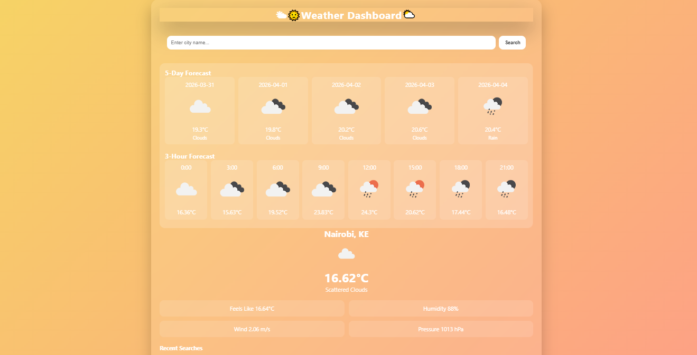
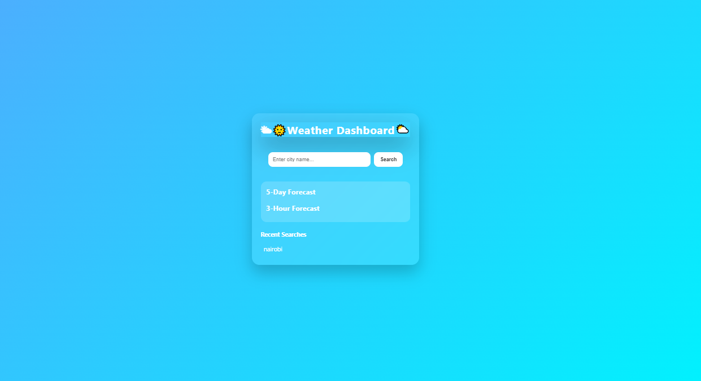

# Week 6: Asynchronous JavaScript
## Author

- **Name:** Amos Kimiti

- **GitHub:** [@Kimiti4](https://github.com/Kimiti4)

- **Date:** May 3, 2026

## Project Description

A responsive weather dashboard that displays current weather conditions, 5-day forecasts, and 3-hour interval forecasts using the OpenWeatherMap API. The project demonstrates mastery of asynchronous JavaScript, API integration, error handling, and modern frontend development practices.

## Technologies Used

- HTML5

- CSS3

- JavaScript (ES6+)

- OpenWeatherMap API

- Fetch API

- LocalStorage API

## Features

- City-based weather search with real-time API integration

- Current weather display (temperature, humidity, wind speed, pressure, feels like)

- 5-day aggregated forecast from 3-hour interval data

- 3-hour interval forecast for detailed planning

- Dynamic backgrounds that change based on weather conditions

- Animated weather effects (rain, snow)

- Recent searches history with localStorage persistence

- Comprehensive error handling for invalid cities and network issues

- Loading states for better user experience

- Responsive design for all screen sizes

## How to Run

1. Clone this repository

2. Open `index.html` in your browser

   OR

3. Replace the API key in `app.js` with your own from OpenWeatherMap

4. Enter a city name and click Search

## Lessons Learned

- Mastered asynchronous JavaScript patterns including callbacks, promises, and async/await

- Learned to work with external REST APIs and handle various response scenarios

- Implemented proper error handling strategies for network requests

- Transformed time-series weather data into meaningful UI components

- Practiced Promise.all and Promise.allSettled for parallel operations

- Gained experience with localStorage for client-side data persistence

- Developed skills in creating dynamic, animated UI effects based on API data

- Understood the importance of loading states and user feedback during async operations

## Challenges Faced

- Parsing 3-hour interval weather data into a clean 5-day summary required careful data aggregation logic

- Managing multiple asynchronous API calls efficiently while maintaining code readability

- Designing a layout that accommodates current weather, 5-day forecast, and 3-hour forecast in a single cohesive view

- Implementing smooth animations for weather effects without impacting performance

- Handling edge cases like invalid city names, network failures, and API rate limits gracefully

- Structuring the codebase for scalability and maintainability

## Screenshots (optional)

## Live Demo (if deployed)

[View Live Demo](https://kimiti4.github.io/iyf-s10-week-06-Kimiti4/)
